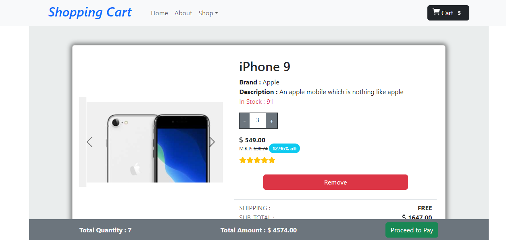

# React-Router-Task

This is an sample cart page website which is based on React Context API which was designed by me using React. It's Guvi-Zen class Roadmap session: Day-28 and React : Day-8 Task.

## Tech Stack

- HTML
- CSS
- Javascript
- Bootstrap
- React(Context API)

## Features

- Responsive and Interactive Design

## Lessons Learned

Through this task I learned why we use Context API and how to use context API.

<b>Why we use Context API</b>: 
- Global State Management
- Avoid Prop Drilling
- Performance Optimization
- 
<b>Usage</b>: 
- <b>createContext()</b>:
	- A context is created using the createContext function. It returns an object with a Provider and a Consumer
- <b>Provider</b>:
  - The Provider component is responsible for providing the context value to its children. It takes a value property, which is the data you want to share.
- <b>useContext ()</b>:
	- It is used to consume a React context within a functional component.

## Website

[Context-Cart-Page]()

## Screenshots

## React + Vite

This template provides a minimal setup to get React working in Vite with HMR and some ESLint rules.

Currently, two official plugins are available:

- [@vitejs/plugin-react](https://github.com/vitejs/vite-plugin-react/blob/main/packages/plugin-react/README.md) uses [Babel](https://babeljs.io/) for Fast Refresh
- [@vitejs/plugin-react-swc](https://github.com/vitejs/vite-plugin-react-swc) uses [SWC](https://swc.rs/) for Fast Refresh

## Setup

Followig are the requirements to run this project:
- vite --> React Project Build Tool
- Node Package Manager (NPM)
- React

## npm run dev

Runs the app in the development mode.\
Open [http://localhost:5173](http://localhost:5173) to view it in your browser.

The page will reload when you make changes.\
You may also see any lint errors in the console.

## Feedback

If you have any feedback, please reach out to me at vijaymayhul@gmail.com

